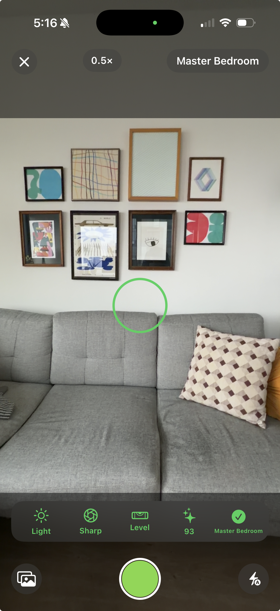

# ShotCoach

Real-time camera coaching for iOS. On-device Vision analysis every frame, cloud AI after the shutter.

[](https://swift.org)
[](https://developer.apple.com/ios/)
[](https://swift.org/package-manager/)
[](LICENSE)

---

## Demo App

<table>
<tr>
<td width="180" valign="top">

</td>
<td valign="top">

**ShotCoachDemo** is a reference iOS app included in the repository showing all four built-in categories in action.

- Live camera overlay with real-time rule feedback (brightness, sharpness, horizon, instagrammability)
- Shot checklist — tracks which required shots have been captured
- Room detection — warns when the camera sees the wrong room for the current shot
- Post-capture cloud analysis with a structured score and recommendations
- Zoom, focus tap, and flash controls wired to the SDK

The source lives in `DemoApp/` and is the recommended starting point for integrating ShotCoach into your own app.

</td>
</tr>
</table>

---

## Architecture

ShotCoach runs a hybrid analysis pipeline — on-device for every frame, cloud only after capture.

```
SCFrame (CVPixelBuffer + metadata)
        │
        ├── SCFrameAnalyzer (actor)
        │       ├── SCBrightnessRule       ─┐
        │       ├── SCHorizonRule           │
        │       ├── SCBlurRule              ├── concurrent withTaskGroup, throttled to 1.5s
        │       ├── SCDistanceRule          │
        │       ├── SCReflectionRule        │
        │       └── SCInstagrammabilityRule ─┘
        │               │
        │               ▼
        │       SCFrameResult → SCAnalysisDelegate (@MainActor)
        │
        └── (on shutter tap)
                SCOpenAIProvider / SCAnthropicProvider
                        │
                        ▼
                SCCloudResult { score, issues, recommendations }
```

**Why hybrid?** Vision.framework gives sub-80ms feedback with zero API cost. GPT-4o or Claude fires once per shot for the structured quality report that on-device models can't produce.

**Why actor isolation for SCFrameAnalyzer?** Rules run concurrently via `withTaskGroup`. The analyzer is an actor so the 1.5s throttle timestamp is mutation-safe across concurrent callers without a lock.

**Why protocol injection for CoreML models?** `SCAestheticRule` accepts any `SCAestheticModelProvider` — the SDK ships no bundled model weights. App targets own the `.mlpackage`, so model updates don't require an SDK release.

## Quick Start

### Pattern A — Zero config

```swift
import ShotCoachCore
import ShotCoachUI

let sdk = ShotCoach(category: .homeListing, apiKey: "sk-...")

SCCameraGuidanceView(sdk: sdk)
    .onResult { photo in print(photo.cloudResult?.score ?? 0) }
```

### Pattern B — Extend a built-in

```swift
ShotCoach(
    category: SCBuiltInCategory.homeListing.extending {
        $0.appendPrompt("Also evaluate pool visibility and outdoor dining areas.")
        $0.addRequiredShot(SCShotType(id: "outdoor", displayName: "Outdoor Space"))
    },
    apiKey: key
)
```

### Pattern C — Fully custom

```swift
struct WatchListingConfig: SCCategoryConfig {
    var categoryID = "watch_listing"
    var displayName = "Watch Photography"
    var requiredShots = [
        SCShotType(id: "dial_face",    displayName: "Dial Face"),
        SCShotType(id: "clasp_detail", displayName: "Clasp Detail"),
        SCShotType(id: "side_profile", displayName: "Side Profile"),
    ]
    var onDeviceRules: [any SCFrameRule] = [
        SCBlurRule(minSharpnessScore: 90),
        SCReflectionRule(),
        SCBrightnessRule(),
    ]
    func cloudPrompt(for shot: SCShotType) -> String {
        "Evaluate this watch listing photo: dial legibility, glare on crystal, clasp condition, background. Return JSON: {score, issues, recommendations}"
    }
}

let sdk = ShotCoach(category: WatchListingConfig(), apiKey: key)
```

## Built-in Categories

| Category | Shots | On-Device Rules |
|---|---|---|
| `.homeListing` | 6 | Brightness, Horizon, Blur, Instagrammability |
| `.carListing` | 8 | Brightness, Reflection, Blur, Distance |
| `.productPhoto` | 6 | Brightness, Blur, Reflection, Horizon |
| `.foodPhoto` | 5 | Brightness, Blur, Horizon (±15°), Instagrammability |

## On-Device Rules

All rules conform to `SCFrameRule` and must complete in under 80ms. They run concurrently per frame inside `SCFrameAnalyzer`.

| Rule | Measures | Signal |
|---|---|---|
| `SCBrightnessRule` | Average luminance (Rec.709) | Under/overexposure |
| `SCHorizonRule` | Horizon tilt via `VNDetectHorizonRequest` | Skewed architectural shots |
| `SCBlurRule` | Laplacian variance sharpness | Camera shake or missed focus |
| `SCDistanceRule` | Subject bounding box area | Subject too far or too close |
| `SCReflectionRule` | Face and upper-body detection (`VNDetectFaceRectanglesRequest` + `VNDetectHumanRectanglesRequest`) | Photographer reflected in mirrors, windows, or glossy product surfaces |
| `SCInstagrammabilityRule` | Focal clarity, compositional balance, visual variety, lighting | Overall composition quality |
| `SCShotClassifierRule` | Scene type via hint-based Vision scoring | Wrong room detection |

## CoreML Aesthetic Pipeline

`SCAestheticRule` blends a CoreML model with the Vision heuristic on every live frame.

```
CVPixelBuffer
    ├── mobileclip_s0_image   (CLIP encoder → 512-D embedding)
    │                                    │
    │                          aesthetic_head_v2
    │                  (normalize → MLP → clamp → score [0, 100])   ── model score
    │                                                                    × modelWeight
    └── SCInstagrammabilityRule  (Vision heuristic)                  ── heuristic score
                                                                        × (1 − modelWeight)
                │
                ▼
        blended score 0–100

        modelWeight per category:
          homeListing / carListing  →  0.7  (30% heuristic blend)
          foodPhoto / productPhoto  →  1.0  (heuristic bypassed — calibrated for interiors)
                │
                ▼
        EMA  (α = 0.3)    ← suppresses per-frame jitter without external state
                │
                ▼
        SCRuleResult { passed, numericScore, message }
```

`aesthetic_head_v2` is a lightweight MLP head (~2 MB) trained on LAION aesthetic scores (val MAE 3.9/100). Normalization is baked into the CoreML export — no pre-processing required at inference time.

The model is injected via `SCAestheticModelProvider` — a `Sendable` protocol the app target implements. The SDK ships no model weights. `DemoApp/MLModels/` contains the reference `.mlpackage` files and `DemoApp/GenericAestheticModel.swift` is the full integration example.

```swift
ShotCoach(
    category: SCBuiltInCategory.productPhoto.extending {
        $0.addRule(SCAestheticRule(model: try GenericAestheticModel(), modelWeight: 1.0))
    },
    apiKey: key
)
```

## Installation

Add to your `Package.swift`:

```swift
dependencies: [
    .package(url: "https://github.com/giorgia/ShotCoachSDK", from: "1.0.0"),
],
targets: [
    .target(name: "YourApp", dependencies: [
        .product(name: "ShotCoachCore", package: "ShotCoachSDK"),  // headless engine
        .product(name: "ShotCoachUI",   package: "ShotCoachSDK"),  // SwiftUI layer (optional)
    ]),
]
```

Or in Xcode: **File → Add Package Dependencies** and enter `https://github.com/giorgia/ShotCoachSDK`.

## Requirements

- iOS 16.0+
- Xcode 15+
- Swift 5.9+
- OpenAI API key (stored in Keychain, never logged or embedded in URLs)

## License

MIT — see [LICENSE](LICENSE).
